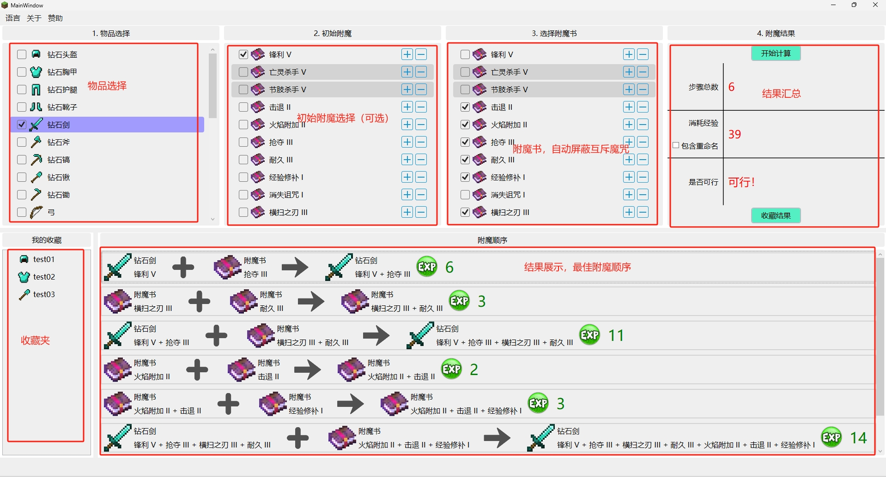
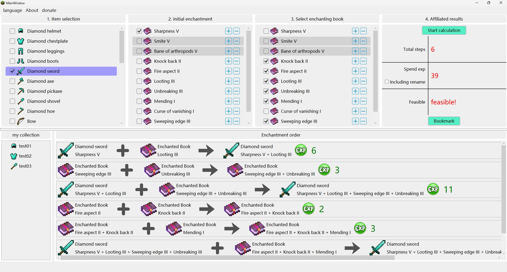
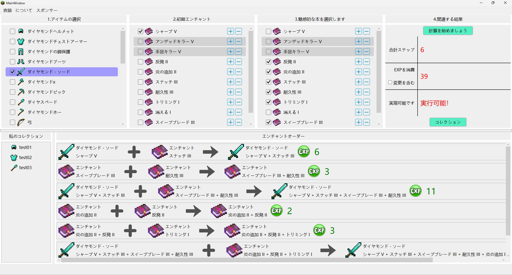

# Minecraft Enchant Calculator

## Project Introduction

Minecraft Enchant Calculator (MEC) is a tool designed to assist Minecraft players in finding the optimal enchantment order for items. Through MEC, players can minimize the consumption of required player experience points, thus enhancing efficiency in enchanting during gameplay.

## Key Features

- Calculates the optimal enchantment order for items.
- Supports various types of enchantments.
- User-friendly interface.
- Multi-language support (machine translated, please verify).
- Utilizes WPF framework and .Net 6.0 (default version), with a minimum support of .Net 4.8.

## Installation and Running

### Method 1. Directly Download the Release Version from this Repository

Note: If prompted with a .Net version too low message, upgrade the .Net version to the minimum requirement of the version you downloaded.

### Method 2. Building from Source

1. Clone the project code to your local machine:
    ```bash
    git clone https://github.com/vvvvvvictory/MinecraftEnchantCalculator.git
    ```
2. Open the solution file `MinecraftEnchantmentCalculator.sln` using Visual Studio 2022.
3. Build the solution and run the project.

## Software Screenshots (V 1.0.0)

Chinese



English



Japanese



## User Guide

1. Launch the program.
2. Select the item to enchant, its initial enchantment (optional), and the enchantment books applicable to the target item.
3. Click the "Calculate" button. The calculator will display the optimal enchantment order, summarizing all results, including required steps, total experience cost, and whether the solution is feasible.

## Contribution

This project serves as the author's first comprehensive WPF exercise project. If you encounter any issues or have suggestions, feel free to submit an issue or pull request.

## License

This software is completely open source and free.

## Author

MEC is developed solely by vvvvvvvictory.