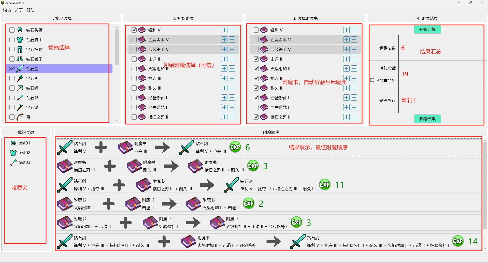
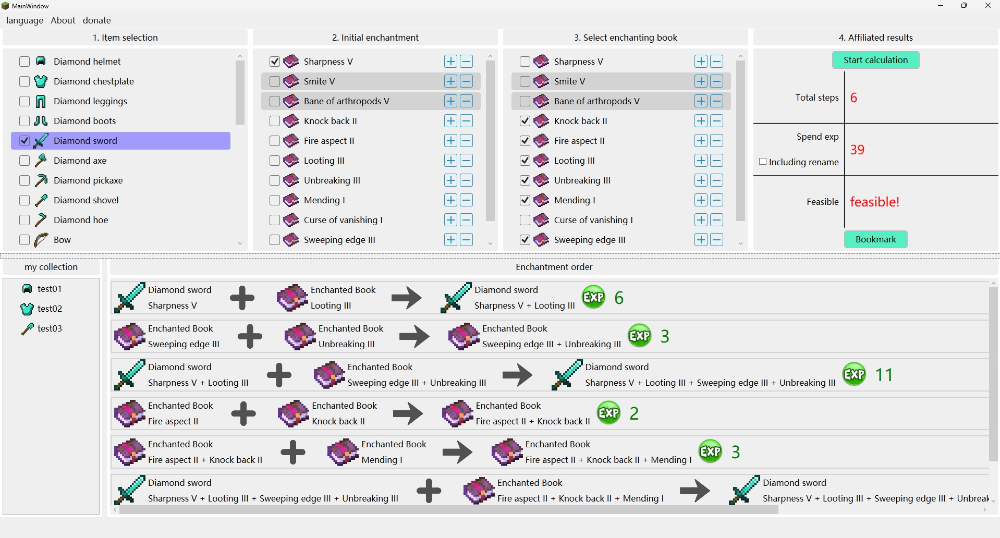
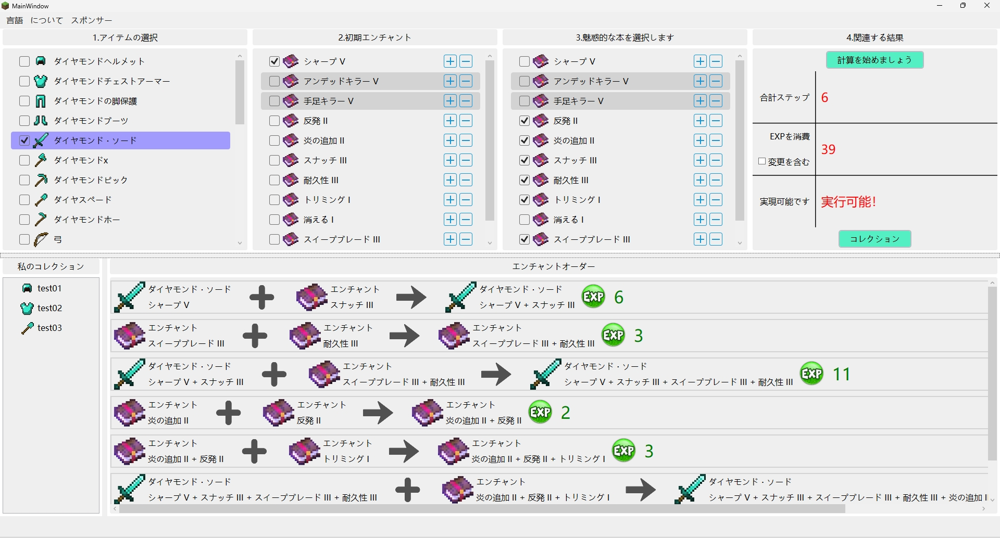

# Minecraft Enchant Calculator
## 项目简介

Minecraft Enchant Calculator （MEC）是一个帮助我的世界玩家找到最优物品附魔顺序的工具。通过MEC，玩家可以最小化消耗所需的玩家经验值，从而在游戏中更有效地进行附魔。

## 功能特点

- 计算最佳的物品附魔顺序。
- 支持各种不同类型的附魔。
- 界面美观
- 支持多国语言（机器翻译，请自行对照）
- 使用WPF框架以及.Net 6.0（默认版本），最低支持.Net 4.8。
## 安装与运行
### 方法1. 直接下载本仓库中的Release版本

注意，如果提示.Net版本过低，请升级.Net版本到你下载版本的最低要求。

### 方法2. 从源码开始构建

1. 克隆项目代码到本地计算机：
   ```bash
   git clone https://github.com/vvvvvvictory/MinecraftEnchantCalculator.git
   ```
2. 使用Visual Studio 2022打开解决方案文件 `MinecraftEnchantmentCalculator.sln`。
3. 构建解决方案并运行项目。

## 软件截图 (V 1.0.0)

中文



英语



日语



## 使用说明

1. 打开本程序。
2. 选择需要附魔的物品、该物品的初始附魔（可选），以及可应用于目标物品的附魔书。
3. 点击“计算”按钮，计算器将显示最优的附魔顺序，并汇总所有结果，包括需要的步骤，总花费经验，以及方案是否可行。

## 贡献
该项目为作者第一个WPF综合练习项目，如果您发现任何问题或者有任何建议，欢迎提交 issue 或者 pull request。
## 许可
该软件完全开源免费
## 作者
MEC 由vvvvvvictory一人开发